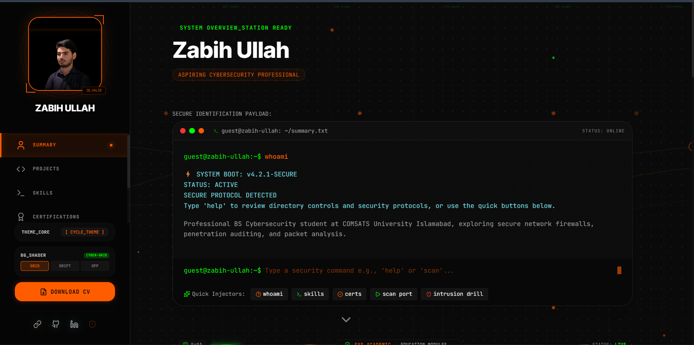

# 🚀 My Cybersecurity Portfolio

---

## 🎯 Live & Deployed

[](https://zabihullah-portfolio.vercel.app/)
[](https://react.dev/)
[](https://www.typescriptlang.org/)
[](https://vitejs.dev/)
[](https://tailwindcss.com/)

[](https://firebase.google.com/)
[](https://firebase.google.com/docs/auth)



---

## 🎨 What's Cooking Here?

| Feature | What It Does |
|---------|-------------|
| 🔐 **Admin Dashboard** | Locked down with Firebase Auth (no randos) |
| 🛠️ **Project Showcase** | Display my security projects & malware analysis |
| 📜 **Certifications** | Track all those fancy certs I earned |
| 🧠 **Skills Grid** | Visual matrix of my tech superpowers |
| ⚡ **Real-time Sync** | Firebase Firestore keeps everything fresh |
| 🎭 **Dark Terminal Vibe** | Cosmic Slate theme = chef's kiss |

---

## 💻 Stack at a Glance

```
Frontend   → React 18 + TypeScript + Tailwind CSS
Backend    → Firebase Firestore (NoSQL magic)
Auth       → Firebase Authentication
Build      → Vite (ridiculously fast ⚡)
Deploy     → Vercel (git push = auto deploy)
```

---

## 🚦 Getting Started

### Local Setup
```bash
npm install
npm run dev
```

### Don't Forget! 
- Copy `.env.example` → `.env`
- Throw your Firebase config in there
- Run and vibe out 🎧

### Deploying to Vercel
1. Push to GitHub
2. Connect to Vercel
3. Add env vars
4. **IMPORTANT:** Add your Vercel domain to Firebase authorized domains (or auth breaks lol 😅)

---

## 🔥 Vibed With

| Tool | Why It Slaps |
|------|------------|
| 🤖 **Google AI Studio** | LLM vibes for smart features |
| 🧵 **Stitch** | Data integration that doesn't suck |
| 🔥 **Firebase** | Real-time backend, no cap |
| 🚀 **Vercel** | Deploy faster than you can say "git push" |

---

**Built by Zabi ❤️**
